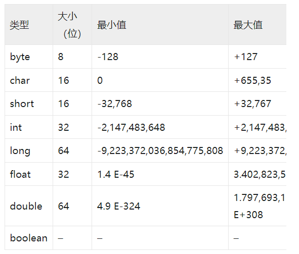

# java

## java基础

### 安装
1.下载源码包并解压
```shell
wget https://repo.huaweicloud.com/java/jdk/8u201-b09/jdk-8u201-linux-x64.tar.gz

tar -zxvf jdk-8u201-linux-x64.tar.gz

mv jdk1.8.0_191 /usr/local/
```

2.配置环境变量
```bash
vim /etc/profile

export JAVA_HOME=/root/jdk1.8.0_201
export CLASSPATH=.:${JAVA_HOME}/jre/lib/rt.jar:${JAVA_HOME}/lib/dt.jar:${JAVA_HOME}/lib/tools.jar
export PATH=$PATH:${JAVA_HOME}/bin

# 配置立即生效
source /etc/profile
```

3.测试
```bash
java -version
```


### 基础语法
示例:
```java
public class HelloWorld {
    public static void main(String[] args) {
        System.out.println("Hello World!");
    }
}
```
1) 大小写敏感
2) 类是一个程序的几班单位,所有的java程序都要运行在类上
3) public 是访问控制符关键词
4) main为主方法, void为返回值, 公开的,静态的主方法, String[]是参数的类型

流程:
- *.java代码源文件 --javac --> *.class字节码文件 -- jvm虚拟机 --> 二进制文件


#### 命名规范:
标识符都以字母（A-Z 或者 a-z），美元符号（$）或下划线（_）开始；首字母后可以是字母、数字、下划线的任意组合；正如我们前面所提到的，标识符是大小写敏感的；需要特别注意的是，Java 中的关键字（本节最后将会介绍）不能被用作标识符。

以下是合法的标识符命名实例：

```java
$name
_World
Imooc
imooc1
```

以下不合法的标识符命名实例：

```java
￥color
12name
*abc
final
```

#### 注释和空行
```java
// 单行注释


/*
多行注释,以/*开始, 以*/结束
*/


/**
文档注释, 以/**开头, 以*/结束
*/
```
#### 数据类型

8中基本数据类型
- byte
- short
- int
- long
- float
- double
- char
- boolean
- 

数字型: short, int, long, float
字符型: byte, char
布尔型: boolean

**需要注意的是，long 类型的值后面要以大写字母 L 或小写字母 l 结尾**

```java
# 整型

// 声明一个短整型变量a
short a = 20;
// 声明一个长整型变量b
long b = 100l;
// 声明一个长整型变量c
long c = 100L;


// 十进制表示数字10
int decimalValue = 10;
// 十六进制表示数字10
int hexadecimalValue = 0xA;
// 二进制表示数字10
int binaryValue = 0b1010;


# 浮点数
分为单精度浮点型 (float) 和双精度浮点型 (double)。
需要注意的是，float 类型的值必须要以大写字母 F 或小写字母 f 结尾
float f1 = 1.2f;
float f2 = 10.56F;


double 类型的值可以以字母 D 或 d 结尾，但不做强制：
// 声明三个double类型变量，其值都为123.3
double d1 = 123.3;
double d2 = 123.3D;
double d3 = 123.3d;


# 布尔值
boolean b1 = true;
boolean b2 = false;


# 字符
字符类型 char 表示一个字符。Java 中的 char 类型除了可表示标准的 ASCII 外，还可以表示一个 Unicode 字符：
// 存放一个 ASCII 码
char a = 97;
// 存放一个Unicode字符
char zh = '慕';
        
        

```


运算符
1)支持条件运算符
```java
变量 = (布尔表达式) ? 值1 : 值2

```
2)instanceof
```java
public class InstanceOfOperators1 {
    public static void main(String[] args) {
        String name = "imooc";
        boolean b = name instanceof String; 
     	System.out.println("结果为：" + b);
    }
}
```
条件语句
1)与PHP中使用方式一致if else if ...


变量
1) 推荐使用小驼峰
2) 如果存储的是一个常量值,将每个字母大写并使用下划线分割
```java
// =左侧的age是变量名，右侧的22是变量值
int age = 22;

// 变量声明
int a;

char b;


// 创建多个通类型的变量
int a, b;
// 同时赋值
int a = 1, b = 2;


```

常量
1) 与变量不同的是，一旦它被赋值后，在程序的运行过程中不允许被改变。常量使用final关键字修饰：
2) 常量的命名规范与普通变量有所不同，要将每个字母大写并用下划线字符分隔每个单词。


```java
final DataType 常量名 = 常量值;

```


类&对象
1) 实例化New
2) 实例变量,类变量,局部变量,参数变量
3) 构造方法声明, 与类名称保持一致即可


---


## tomcat

### 安装
1.下载源码
```bash
wget https://dlcdn.apache.org/tomcat/tomcat-9/v9.0.56/bin/apache-tomcat-9.0.56.tar.gz

tar -xf apache-tomcat-9.0.56.tar.gz -C /usr/local/

mv /usr/local/apache-tomcat-9.0.56 /usr//local/tomcat
```

2.添加配置文件

```bash
vim /etc/profile.d/tomcat.sh

#加入配置
export TOMCAT_HOME=/usr/local/tomcat/

source /etc/profile.d/tomcat.sh
```


### 使用

```bash
#1.启动
/usr/local/tomcat/bin/startup.sh

#2.查看版本信息
/usr/local/tomcat/bin/version.sh

#3.停止服务
/usr/loca/tomcat/bin/shutdown.sh

#4.查看服务
ps -ef|grep tomcat

# 服务启动默认端口：8080
```


