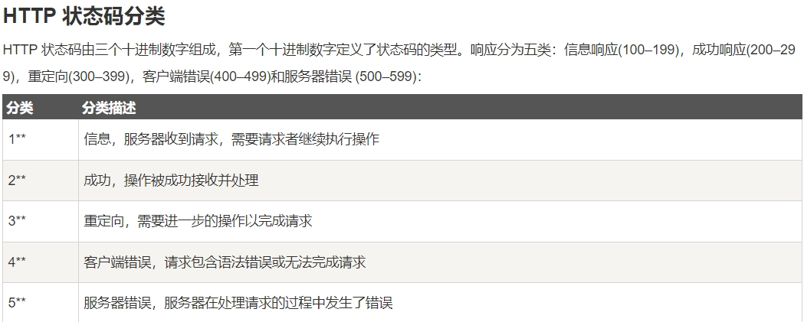
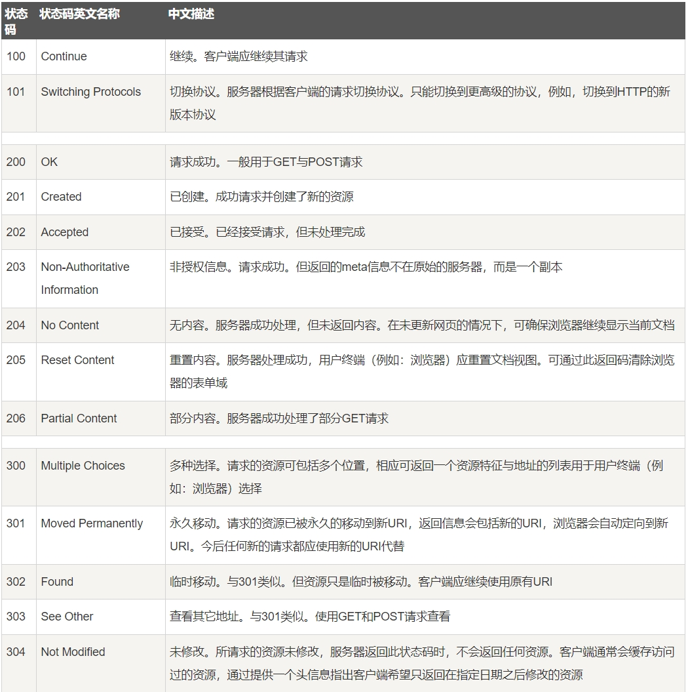
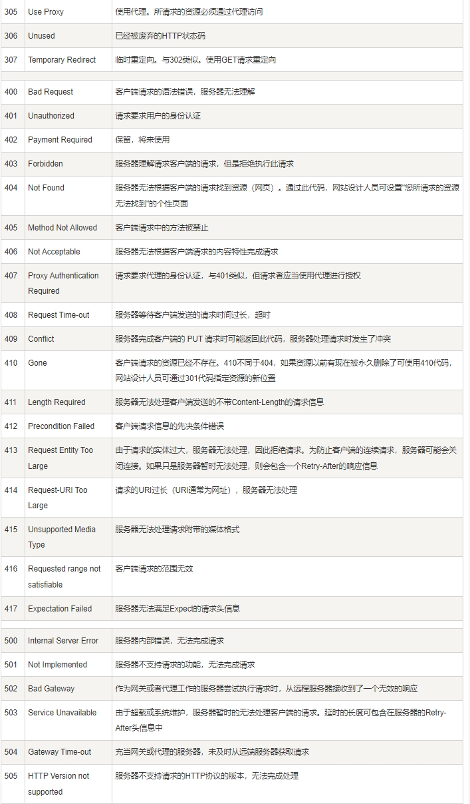

# 网络相关面试题

## 常见HTTP状态码
- 200 - 请求成功
- 301 - 资源永久转移到其他URL上
- 404 - 请求资源不存在
- 500 - 内部服务器错误

详情:

## 进程,线程,协程区别

1. 线程是程序执行的最小单位，而进程是操作系统分配资源的最小单位；
2. 一个进程由一个或多个线程组成，线程是一个进程中代码的不同执行路线；
3. 进程之间相互独立，但同一进程下的各个线程之间共享程序的内存空间(包括代码段、数据集、堆等)及一些进程级的资源(如打开文件和信号)，某进程内的线程在其它进程不可见；
4. 调度和切换：线程上下文切换比进程上下文切换要快得多。

### 进程间通信:
管道(pipe)
管道是一种半双工的通信方式，数据只能单向流动，而且只能在具有亲缘关系的进程间使用。进程的亲缘关系通常是指父子进程关系。

有名管道 (namedpipe)
有名管道也是半双工的通信方式，但是它允许无亲缘关系进程间的通信。

信号量(semaphore)
信号量是一个计数器，可以用来控制多个进程对共享资源的访问。它常作为一种锁机制，防止某进程正在访问共享资源时，其他进程也访问该资源。因此，主要作为进程间以及同一进程内不同线程之间的同步手段。

消息队列(messagequeue)
消息队列是由消息的链表，存放在内核中并由消息队列标识符标识。消息队列克服了信号传递信息少、管道只能承载无格式字节流以及缓冲区大小受限等缺点。

信号 (sinal)
信号是一种比较复杂的通信方式，用于通知接收进程某个事件已经发生。

共享内存(shared memory)
共享内存就是映射一段能被其他进程所访问的内存，这段共享内存由一个进程创建，但多个进程都可以访问。共享内存是最快的 IPC 方式，它是针对其他进程间通信方式运行效率低而专门设计的。它往往与其他通信机制，如信号量，配合使用，来实现进程间的同步和通信。

套接字(socket)
套接口也是一种进程间通信机制，与其他通信机制不同的是，它可用于不同设备及其间的进程通信。

线程是进程的一个实体,是CPU调度和分派的基本单位,它是比进程更小的能独立运行的基本单位.线程自己基本上不拥有系统资源,只拥有一点在运行中必不可少的资源(如程序计数器,一组寄存器和栈)

线程间通信:
主要通过共享内存，上下文切换很快，资源开销较少，但相比进程不够稳定容易丢失数据。

协程:
协程是一种用户态的轻量级线程，协程的调度完全由用户控制。协程拥有自己的寄存器上下文和栈。协程调度切换时，将寄存器上下文和栈保存到其他地方，在切回来的时候，恢复先前保存的寄存器上下文和栈，直接操作栈则基本没有内核切换的开销，可以不加锁的访问全局变量，所以上下文的切换非常快。

参考: https://www.cnblogs.com/fanguangdexiaoyuer/p/10834737.html

## TCP、UDP、HTTP、SOCKET之间的区别与联系

在应用层有FTP、HTTP、TELNET、SMTP、DNS等协议。
在传输层中有TCP协议与UDP协议。

SOCKET：TCP/IP网络的API。

